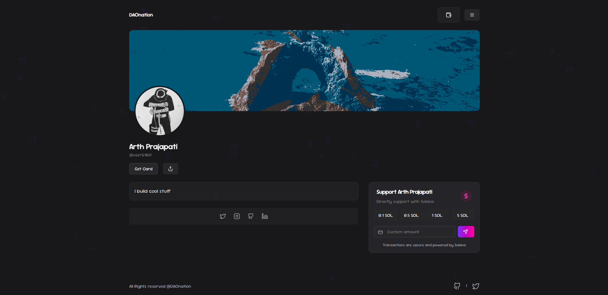

# DAOnation


DAOnation is a decentralized platform that enables creators, developers, and organizations to accept cryptocurrency contributions effortlessly. It's a crypto-powered alternative to traditional "Buy Me a Coffee" platforms, designed for the Web3 era.

<p align="center">
  
</p>

## 📋 Table of Contents

- [Overview](#overview)
- [Tech Stack](#tech-stack)
- [Key Features](#key-features)
- [Getting Started](#getting-started)
  - [Prerequisites](#prerequisites)
  - [Installation](#installation)
  - [Environment Variables](#environment-variables)
- [Usage](#usage)
- [Project Structure](#project-structure)
- [Contributing](#contributing)
- [License](#license)
- [Acknowledgments](#acknowledgments)

## 🌟 Overview

DAOnation bridges the gap between content creators and their supporters in the Web3 ecosystem. Our platform allows users to create personalized profiles with unique usernames, share profile links to receive crypto contributions, and track all their earnings in one dashboard.

## 🛠️ Tech Stack

- **Frontend Framework**: Next.js 15 (App Router)
- **UI Library**: React 18
- **Language**: TypeScript
- **Styling**: Tailwind CSS, shadcn/ui, Radix UI
- **Authentication**: NextAuth.js
- **Database**: Prisma ORM
- **Blockchain Integration**: Solana Web3.js
- **Wallet Adapters**: Solana Wallet Adapter
- **Animation**: Framer Motion, React Spring, tsParticles
- **Charts**: Recharts
- **Deployment**: Vercel

## ✨ Key Features

- **Crypto-First**: Direct wallet-to-wallet transactions with no intermediaries
- **Personalized Profiles**: Custom usernames and profile pages for easy sharing
- **Multi-Wallet Support**: Connect with various Solana wallets
- **Real-time Analytics**: Track contributions and engagement metrics
- **Responsive Design**: Optimized for all devices and screen sizes
- **QR Code Generation**: Easily shareable QR codes for your donation page
- **Transaction Explorer**: Verify transactions on the blockchain

## 🚀 Getting Started

### Prerequisites

- Node.js (v18 or higher)
- Bun or npm
- A Solana wallet (for testing)

### Installation

1. Clone the repository:
   ```bash
   git clone https://github.com/yourusername/daonation.git
   cd daonation
   ```

2. Install dependencies:
   ```bash
   bun install
   # or
   npm install
   ```

3. Set up the database:
   ```bash
   # using docker
   sudo docker run -d --name postgres -e POSTGRES_USER=postgres -e POSTGRES_PASSWORD=postgres -e  POSTGRES_DB=postgres -p 5432:5432 postgres
   ```
   ```bash
   npx prisma generate
   npx prisma db push
   ```

4. Start the development server:
   ```bash
   bun run dev
   # or
   npm run dev
   ```

### Environment Variables

Create a `.env` file in the root directory with the following variables:

```env
# Database
DATABASE_URL="your-database-url"

# NextAuth
NEXTAUTH_URL="http://localhost:3000"
NEXTAUTH_SECRET="your-nextauth-secret"

# Other services
EDGE_STORE_ACCESS_KEY=
EDGE_STORE_SECRET_KEY=
GOOGLE_CLIENT_ID=
GOOGLE_CLIENT_SECRET=
```

## 💻 Usage

1. **Create an Account**:  
   Sign up with a unique username and connect your crypto wallet.

2. **Customize Your Profile**:  
   Add your details, social links, and a description of your work.

3. **Share Your Profile**:  
   Use your unique link (daonation.xyz/yourusername) to receive contributions.

4. **Track Your Contributions**:  
   Access your personal dashboard to monitor earnings and manage transactions.

## 📂 Project Structure

```
daonation/
├── actions/         # Server actions for data mutations
├── app/             # Next.js app directory with routes
├── components/      # Reusable UI components
├── db/              # Database configuration
├── lib/             # Utility functions and shared logic
├── prisma/          # Prisma schema and migrations
├── public/          # Static assets
└── ...
```

## 👥 Contributing

We welcome contributions to DAOnation! Please follow these steps:

1. Fork the repository
2. Create a new branch (`git checkout -b feature/amazing-feature`)
3. Make your changes
4. Commit your changes (`git commit -m 'Add some amazing feature'`)
5. Push to the branch (`git push origin feature/amazing-feature`)
6. Open a Pull Request


## 📜 License

This project is licensed under the MIT License - see the [LICENSE](LICENSE) file for details.

## 🙏 Acknowledgments

- The Solana ecosystem for providing the tools and infrastructure
- All open-source projects that made this possible
- Our early adopters and community members

---

<p align="center">
  <a href="https://daonation.xyz">Visit DAOnation</a> 
</p>
